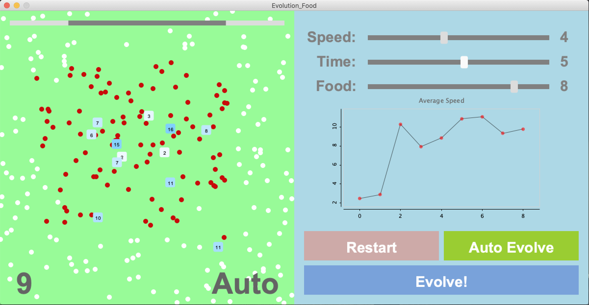

# Evolution_Food

A simple evolution simpulator built with Processing. Tracks the evolution of a microcosm of "organisms" over time, graphing the results. Observe the effects as you manipulate food abundance, generation time and organism speed. 

To build, you must have Processing 3 installed. 
